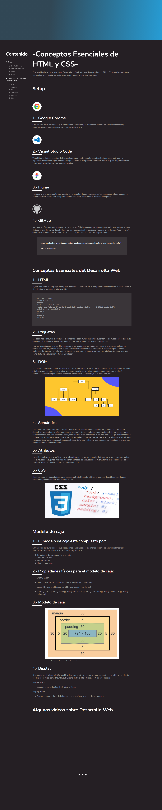

# Esencial-HTML-CSS
Conceptos básicos de desarrollo web de HTML y CSS sin uso de Flexbox y CSS Grid Layout

Esto es con lo que trabajamos los Frontends todos los días.

**Maquetado tu primer blog usando HTML y CSS**

Uso de Scroll sin JavaScript
